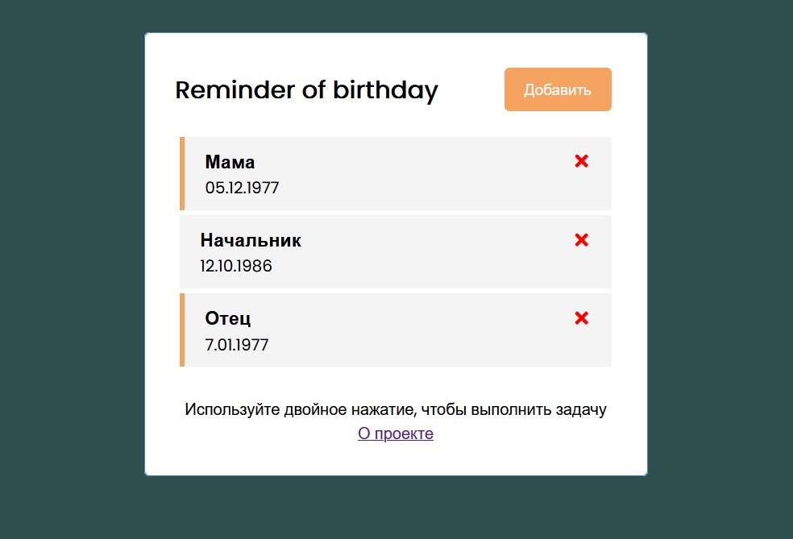
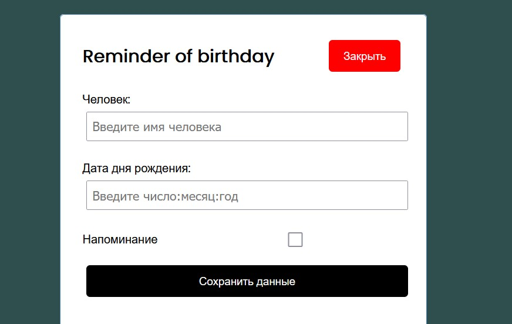

# Edu simple todo list for remind of birthday

  
  

# How start project:

1. `yarn` - install dependencies 

2. `yarn start` - start project

3. `yarn upgrade` - solve version problem 

# TODO:

1. Add Redux 
2. Add TypeScript
3. Add localStorage
4. Add light/dark theme